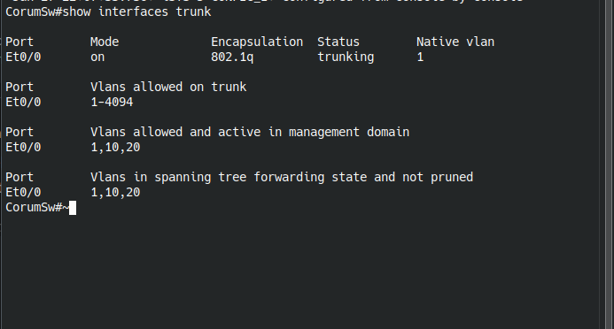
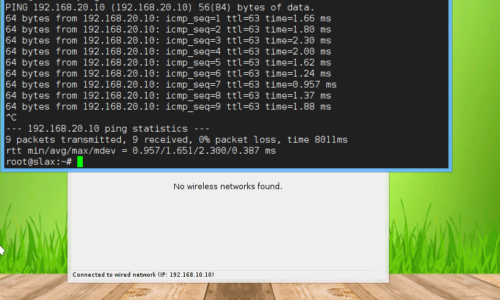
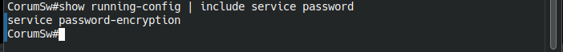
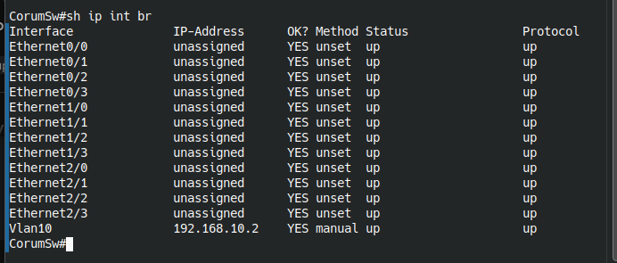

# 🌰 Corum Leblebi Network Project (CLNP)

### 🚀 Proje Hakkında (The Story)
Bilgisayar Mühendisliği mezunu olarak kariyerimi global firmalarda planlarken, Çorumlu dayımın *"Yeğenim, gel leblebi imparatorluğunun başına geç, bilişimi sen yönet"* teklifiyle kendimi aile şirketimizde buldum.

Bu proje; sıradan bir esnaf dükkanının (KOBİ), adım adım **Enterprise (Kurumsal)** bir ağ altyapısına dönüşüm hikayesidir.

---

## 📅 FAZ 1: Dükkan & Temel İzolasyon
**Senaryo:** Dükkanda Dayı'nın POS cihazı ile çırak Satılmış'ın oyun oynadığı bilgisayar aynı ağdaydı. Virüs ve bant genişliği sorunları yaşanıyordu.
**Çözüm:** Layer 2 seviyesinde VLAN izolasyonu uygulandı.

### 🗺️ Ağ Topolojisi

*(Görsel: Çorum Merkez Dükkan - VLAN Ayrımı)*

### 🔧 Teknik Detaylar

| VLAN ID | İsim | Subnet | Kullanım Amacı |
| :--- | :--- | :--- | :--- |
| **10** | **DUKKAN (Bizimkiler)** | `192.168.10.0/24` | POS Cihazı, Kamera, Patron PC (Güvenli Alan) |
| **20** | **MISAFIR (Elalem)** | `192.168.20.0/24` | Çırak PC, Müşteri Wi-Fi (Kısıtlı Alan) |

### ⚙️ Kullanılan Teknolojiler
* **VLAN Segmentation:** Departmanların trafiğini izole etmek için.
* **Access & Trunk Ports:** Cihaz ve Switchler arası bağlantı.
* **Cisco IOS & Linux:** Simülasyon ortamı.
* **Password Encryption & VTY Security**
* **Management SVI:** Switch yönetimi için VLAN 10 bloğundan `192.168.10.2` IP adresi atandı.
* **Banner MOTD:** Yasal uyarı ve loglama bilgilendirmesi giriş ekranına eklendi.

### 📸 Sistem Kanıtları (Screenshots)
### 📸 Sistem Kanıtları (Screenshots)

**1. VLAN Yapılandırması (VLAN Brief):**
Dükkan (10) ve Misafir (20) VLAN'larının oluşturulduğu görülmektedir.

**2. Trunk & Access Portlar:**
Hangi portun hangi modda olduğu doğrulanmıştır.

**3. Ping Testi (VLAN 10 <-> VLAN 20):**
Departmanlar arası erişim test edilmiştir.

**4. SSH Bağlantı Kanıtı:**
Router'a uzaktan güvenli erişim sağlanmıştır.

**5. Güvenlik (Encryption & SVI):**
Şifreleme servisleri ve Yönetim IP'si (SVI) kontrolü.

