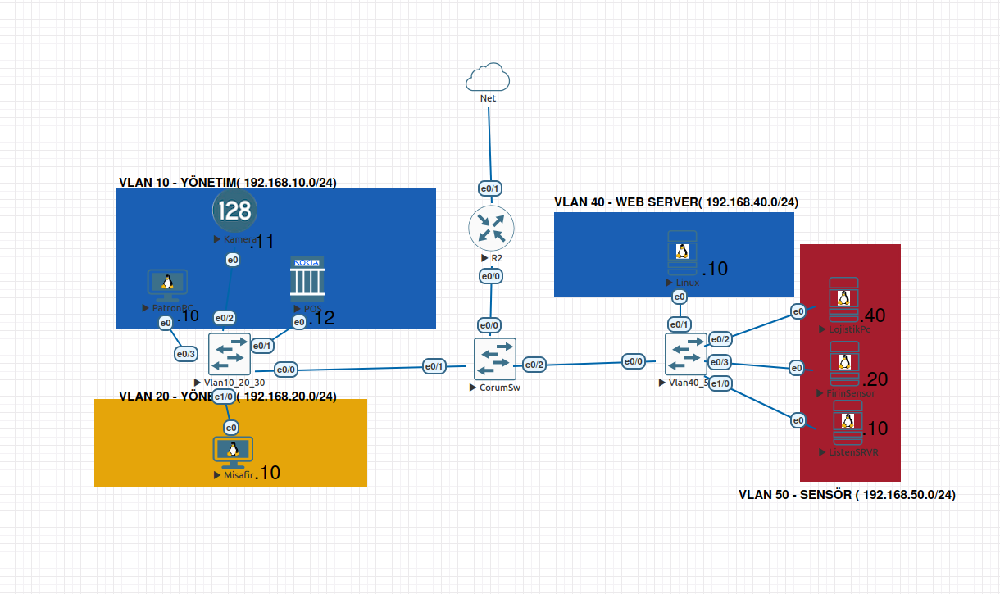
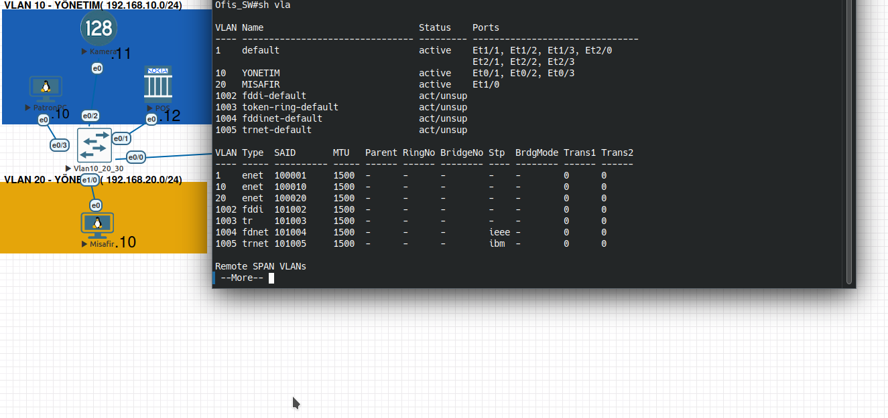
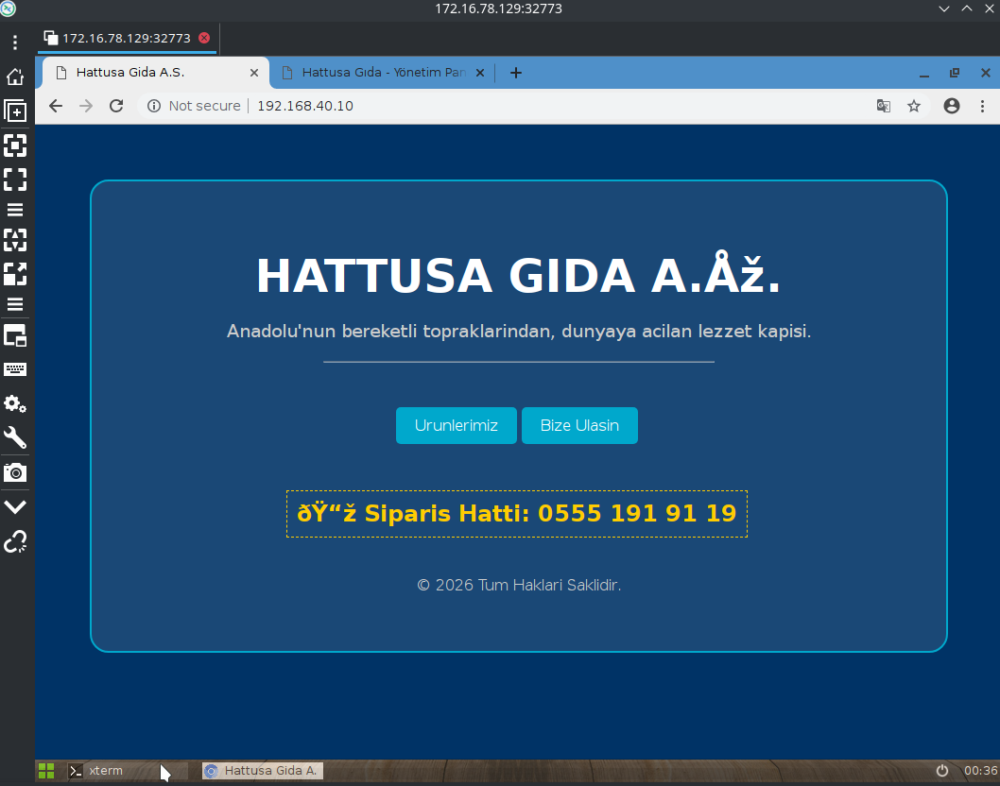
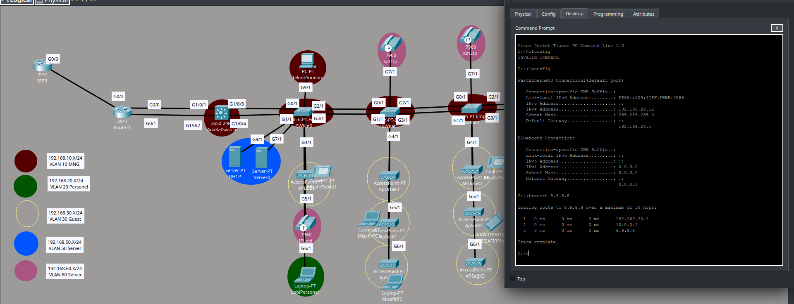
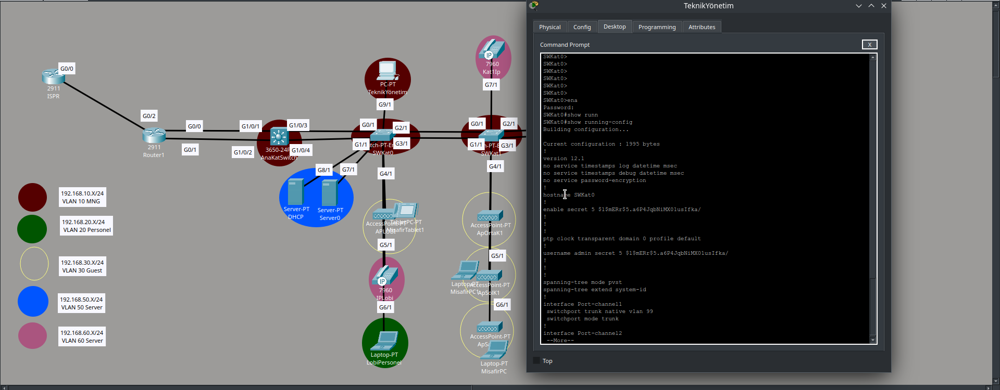

# 🏨 Kurumsal Otel Ağ Altyapısı (L2/L3 Security & Redundancy)

Bu proje, gerçek dünya senaryolarına uygun olarak; yüksek erişilebilirlik, güvenlik ve uzaktan yönetim standartlarında tasarlanmış bir otel ağı simülasyonudur.

## 🛠️ Uygulanan Teknolojiler ve Yapılandırmalar

### 1. Layer 2 Güvenlik (Switch Hardening)
- **Port Security:** Odalardaki portlara yetkisiz cihaz (Rogue Device) takılmasını önlemek için MAC adresi sabitleme (Sticky MAC) ve ihlal durumunda kapatma (Shutdown) politikaları uygulandı.
- **Protected Ports (PVLAN Edge):** Misafir odaları (VLAN 20) arasında L2 izolasyon sağlandı. Misafirler birbirini göremez, sadece Gateway'e gidebilir.
- **DHCP Snooping & ARP Inspection:** (Opsiyonel: İleride eklenecek notu)

### 2. Layer 3 Yedeklilik (Redundancy)
- **ECMP (Equal Cost Multi-Path):** Edge Router ile Core Switch arasında çift fiziksel hat kullanıldı.
- **Routing:** Statik yönlendirme ile yük dengeleme (Load Balancing) yapılarak tek hattın kopması durumunda kesintisiz erişim sağlandı.

### 3. WAN & İnternet Erişimi
- **NAT/PAT (Network Address Translation):** İç ağdaki (192.168.x.x) tüm kullanıcıların, tek bir Public IP üzerinden ISP'ye çıkışı sağlandı.
- **ISP Bağlantısı:** Telekom Router'ı ve Google DNS (8.8.8.8) simülasyonu ile uçtan uca internet erişimi test edildi ve doğrulandı.

### 4. Yönetim (Management)
- **SSHv2:** Tüm cihazlarda (Router ve Switchler) Telnet kapatıldı, RSA 1024-bit şifrelemeli SSH erişimi aktif edildi.
- **VLAN Segmentation:** Yönetim trafiği (VLAN 10) ile kullanıcı trafiği tamamen izole edildi.

## 🧪 Test Sonuçları
- **Ping Testi:** Misafir VLAN'ından 8.8.8.8 erişimi > **BAŞARILI**
- **Failover Testi:** Router'ın bir kablosu koptuğunda ping kesintisi > **YOK (BAŞARILI)**
- **SSH Testi:** Admin PC'den switch yönetimi > **BAŞARILI**

## 📸 Test ve Doğrulama Kanıtları (Screenshots)

Ağın beklenen şekilde çalıştığı, güvenlik kurallarının (ACL) aktif olduğu ve yedekliliğin sağlandığı aşağıdaki testlerle doğrulanmıştır.

### 1. Ağ Topolojisi (Genel Bakış)
Kurulan ağın genel yapısı, VLAN dağılımı ve yedekli hatlar.

### 2. VLAN ve IP Yapılandırması
Cihazların ilgili VLAN'larda olduğu ve IP aldıkları doğrulanmıştır.

### 3. Web/İnternet Erişim Testi
Kullanıcıların internete (Web Sunucusuna) erişebildiği test edilmiştir.

### 4. ACL Güvenlik Testi (Yasaklı Erişim)
Misafir veya yetkisiz cihazların, korunan ağlara (VLAN 20/IoT) erişimi **Engellenmiştir**.
*(Kanıt: "Request timed out" veya "Destination host unreachable")*

### 5. Yönlendirme Testi (Traceroute)
Paketlerin doğru rotayı izleyerek hedefe ulaştığını gösteren yol haritası.

### 6. Uzaktan Yönetim (SSH)
Yönetim cihazlarına sadece yetkili VLAN'dan güvenli (SSH) erişim sağlanmaktadır.

---
*Proje Sahibi: Asım Murat Çapkın

