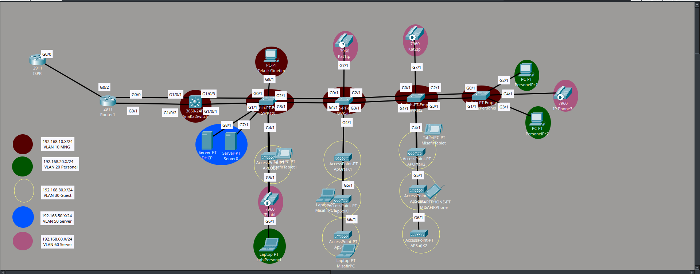
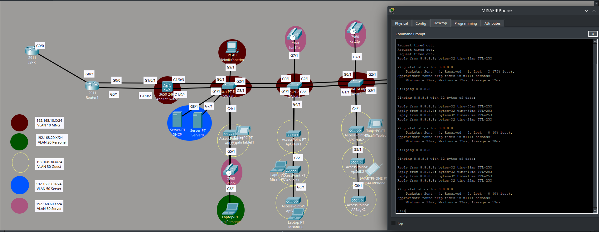
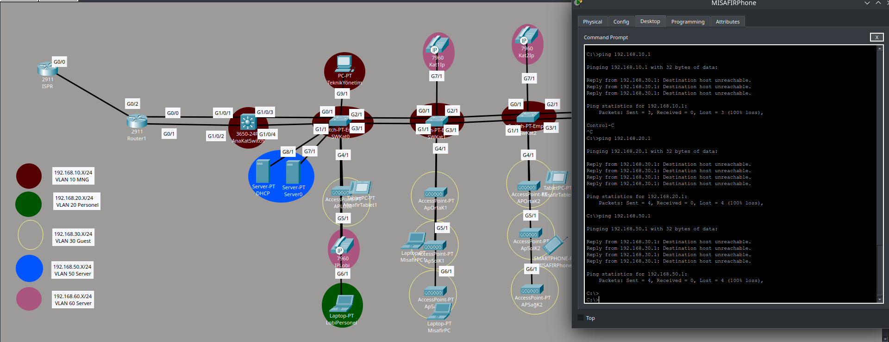
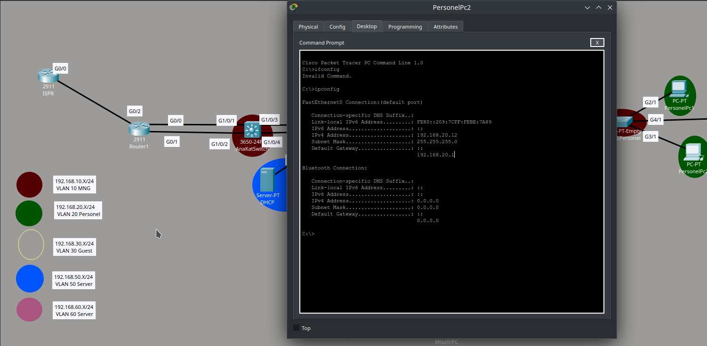

# 🏨 Kurumsal Otel Ağ Altyapısı (L2/L3 Security & Redundancy)

Bu proje, gerçek dünya senaryolarına uygun olarak; yüksek erişilebilirlik, güvenlik ve uzaktan yönetim standartlarında tasarlanmış bir otel ağı simülasyonudur.

## 🛠️ Uygulanan Teknolojiler ve Ağ Mimarisi

Bu projede kurumsal ölçekli bir ağda olması gereken yedeklilik, performans ve güvenlik protokolleri eksiksiz uygulanmıştır.

### 1. Layer 2 Anahtarlama ve VLAN Yönetimi
- **VTP (VLAN Trunking Protocol):** VLAN veritabanı yönetimi merkezi hale getirildi. Core Switch **"Server"**, Kenar Switchler **"Client"** modunda yapılandırılarak VLAN tutarlılığı sağlandı.
- **EtherChannel (LACP):** Switchler arasındaki bağlantılar birleştirilerek (Link Aggregation) bant genişliği artırıldı ve fiziksel kablo yedekliliği sağlandı.
- **STP (Spanning Tree Protocol):** Kenar portlarda **PortFast** ve **BPDUGuard** aktif edilerek, PC ve IP Telefonların ağa anında katılması sağlandı ve döngü (loop) oluşumu engellendi.

### 2. DHCP ve IP Adres Yönetimi
- **Merkezi DHCP Sunucusu:** Tüm IP dağıtımı, Server VLAN'ında (VLAN 50) bulunan merkezi sunucu üzerinden yönetilmektedir.
- **DHCP Relay (IP Helper):** Farklı VLAN'lardaki (Personel, Misafir, VoIP) cihazların IP alabilmesi için Core Switch üzerinde `ip helper-address` komutu ile DHCP yönlendirmesi (Relay Agent) yapılmıştır.

### 3. Ağ Güvenliği (Security & ACL)
- **ACL (Erişim Kontrol Listeleri):** - **Misafir İzolasyonu:** Misafirlerin (VLAN 30) iç ağa (Personel/Server) erişimi engellendi, sadece internete çıkış izni verildi.
  - **Yönetim Güvenliği:** Switch ve Router yönetim panellerine (SSH) sadece IT Yönetim VLAN'ından (VLAN 10) erişim izni tanımlandı.
- **Port Security:** Yetkisiz erişimleri önlemek için portlarda **Sticky MAC** ve **Max: 2 Device** (PC+Telefon) kuralı uygulandı. İhlal durumunda port kendini kısıtlar (Restrict).
- **Protected Ports (PVLAN Edge):** Misafir odaları arasında L2 izolasyon sağlandı; misafirler birbirini göremez, sadece Gateway'e gidebilir.

### 4. Layer 3 Yönlendirme ve WAN
- **Inter-VLAN Routing:** VLAN'lar arası geçişler Core Switch üzerinde (SVI) yapılandırıldı.
- **Redundancy (Yedeklilik):** Edge Router ile Core Switch arasında çift hat üzerinden yük dengeleme (ECMP) kurgulandı.
- **NAT/PAT:** İç ağ kullanıcılarının tek bir Public IP üzerinden internete çıkışı (Overload) sağlandı.

## 📸 Test ve Doğrulama Kanıtları (Screenshots)

Ağın beklenen şekilde çalıştığı, güvenlik kurallarının (ACL) aktif olduğu ve yedekliliğin sağlandığı aşağıdaki testlerle doğrulanmıştır.

### 1. Ağ Topolojisi (Genel Bakış)
Kurulan ağın genel yapısı, VLAN dağılımı ve yedekli hatlar.

### 2. VLAN ve IP Yapılandırması
Cihazların ilgili VLAN'larda olduğu ve IP aldıkları doğrulanmıştır.

### 3. Web/İnternet Erişim Testi
Kullanıcıların internete (Web Sunucusuna) erişebildiği test edilmiştir.

### 4. ACL Güvenlik Testi (Yasaklı Erişim)
Misafir veya yetkisiz cihazların, korunan ağlara (VLAN 20/IoT) erişimi **Engellenmiştir**.
*(Kanıt: "Request timed out" veya "Destination host unreachable")*

### 5. Yönlendirme Testi (Traceroute)
Paketlerin doğru rotayı izleyerek hedefe ulaştığını gösteren yol haritası.

### 6. Uzaktan Yönetim (SSH)
Yönetim cihazlarına sadece yetkili VLAN'dan güvenli (SSH) erişim sağlanmaktadır.

### 6. DHCP
It dışındaki ağların dhcp serverdan ip alması sağlandı.

---
*Proje Sahibi: Asım Murat Çapkın

