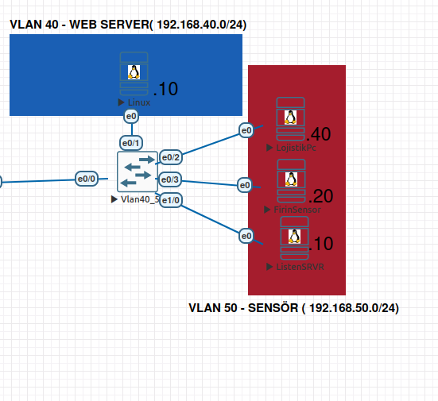
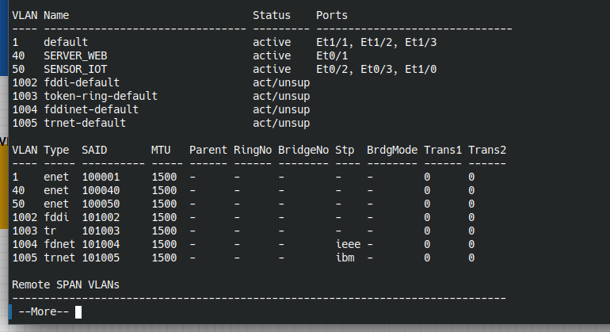
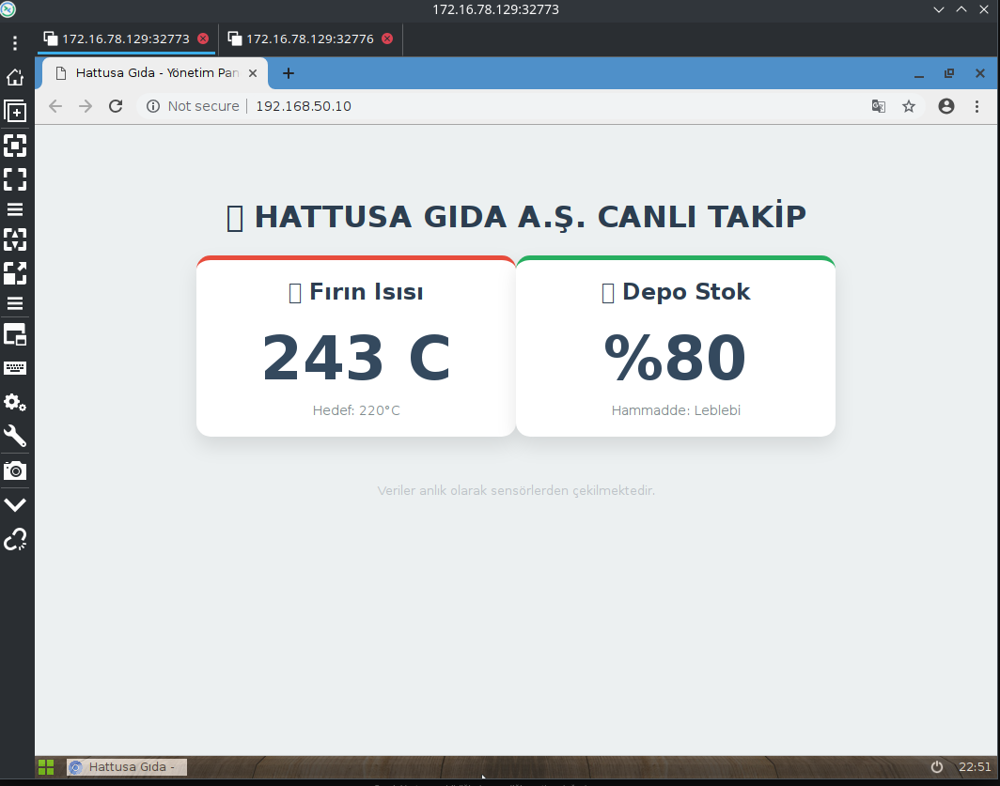
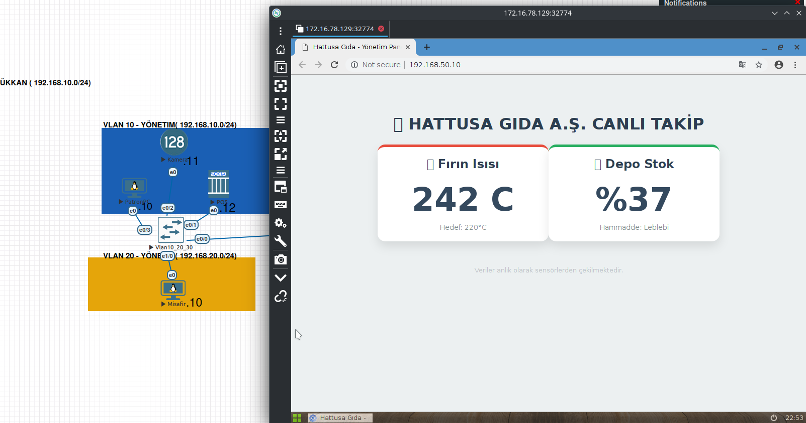
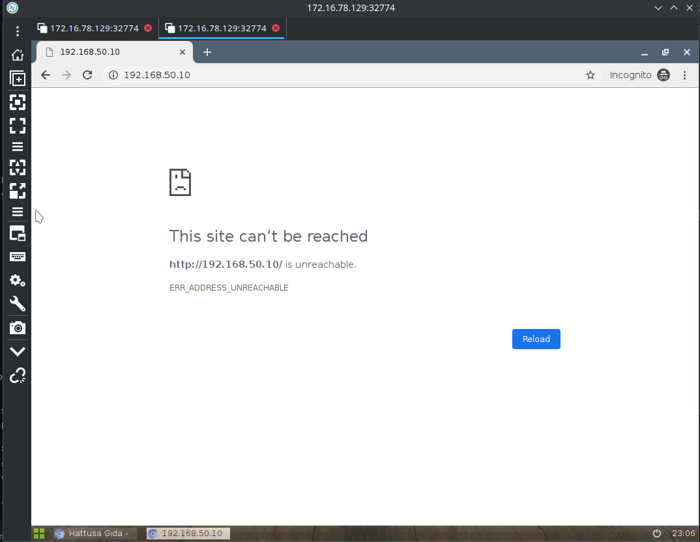

# 🏺 Hattusa Gıda - Faz 1: Kenar Ağ Yapılandırması

Bu bölümde, ağın sol tarafındaki uç cihazları yönetmek için kurulan **Vlan10_20_30** switch'inin teknik detayları yer almaktadır.

---

## 1. VLAN Tanımlamaları
Ağdaki departmanlar, `sh vlan` çıktısına uygun olarak aşağıdaki gibi izole edilmiştir:

* **VLAN 10**: YONETIM
* **VLAN 20**: MISAFIR
 ```bash 
vlan 10
 name YONETIM
vlan 20
 name MISAFIR
vlan 30
 name CIHAZLAR
``` 

## 2. Port Atamaları (Access Ports)

Cihazların ilgili ağlara dahil edilmesi için yapılan port yapılandırmaları:

  - Yönetim Bloğu (VLAN 10): Patron PC, Kamera ve POS cihazlarını kapsar.

  - Misafir Bloğu (VLAN 20): Harici kullanıcı girişi için ayrılmıştır.

```bash
! Patron, Kamera ve POS (VLAN 10)
interface range Ethernet0/1 - 3
 switchport mode access
 switchport access vlan 10
 description YONETIM_CIHAZLARI

! Misafir PC (VLAN 20)
interface Ethernet1/0
 switchport mode access
 switchport access vlan 20
 description MISAFIR_ERISIMI

``` 

## 3.Trunk Port Yapılandırması (Kritik Hat) 🚀

Bu switch'in ana omurgaya bağlanmasını sağlayan en önemli parçadır. Tek kablo üzerinden tüm VLAN trafiğini etiketli (tagged) olarak taşır.

```bash
interface Ethernet0/0
 description TRUNK_TO_CORUM_SW
 switchport trunk encapsulation dot1q
 switchport mode trunk
``` 
### 🖥️ VLAN Doğrulama Testi
Aşağıdaki görselde, VLAN yapılandırmasının başarılı bir şekilde çalıştığı ve switch üzerindeki port atamaları görülmektedir:


# Faz 1.2: Sunucu ve IoT Bölgesi Yapılandırması

Ağın sağ tarafında, kurumsal web sunucusu ve IoT sensörlerinin yönetimini sağlayan **Vlan40_50** switch'inin yapılandırması tamamlanmıştır.
* **VLAN 40**: SERVER_WEB (Kurumsal Sunucu)
* **VLAN 50**: SENSOR_IOT (Üretim Hattı Sensörleri)

```bash
vlan 40
 name SERVER_WEB


vlan 50
 name SENSOR_IOT
```
## 2. Port Atamaları (Access Ports)

Cihazların ilgili sunucu ağlarına dahil edilmesi için yapılan yapılandırmalar:

   Web Sunucusu (VLAN 40): Linux tabanlı kurumsal sunucu bu port üzerinden hizmet verir.

   IoT Sensör Bloğu (VLAN 50): Üretim hattındaki farklı sensör ve kontrol cihazlarını kapsar.


```bash
   ! Kurumsal Web Sunucusu (VLAN 40)
interface Ethernet0/1
 switchport mode access
 switchport access vlan 40
 description WEB_SERVER_PORT

! IoT Sensörleri ve Kontrolörler (VLAN 50)
interface range Ethernet0/2 - 3, Ethernet1/0
 switchport mode access
 switchport access vlan 50
 description IOT_SENSORS_BLOCK
 ```
## 3. Trunk Port Yapılandırması 🚀

Bu switch'in ana omurga (CorumSw) ile haberleşmesini sağlayan Trunk hattı:
```bash

interface Ethernet0/0
 description TRUNK_TO_CORUM_SW
 switchport trunk encapsulation dot1q
 switchport mode trunk
```
---

### 🖥️ VLAN Doğrulama Testi
Aşağıdaki görselde, VLAN yapılandırmasının başarılı bir şekilde çalıştığı ve switch üzerindeki port atamaları görülmektedir:




# 🏺 Faz 2: Ağ Geçidi ve Servis Erişimi (Router R2)

## 🛠️ Router (R2) - Tam Kodlar (Web Sunucu & IoT Dahil)

Bu kod bloğunda; Yönetim, Misafir, Web Sunucu (VLAN 40) ve IoT ağlarının tamamı tanımlanmıştır. Ayrıca IoT koruması ve genel internet çıkışı aktiftir.

```bash

! --- 1. INTER-VLAN ve NAT ARAYÜZ AYARLARI ---

! Yönetim Ağı (VLAN 10)
interface Ethernet0/0.10
 description YONETIM_AGI
 encapsulation dot1q 10
 ip address 192.168.10.1 255.255.255.0
 ip nat inside
!
! Misafir Ağı (VLAN 20)
interface Ethernet0/0.20
 description MISAFIR_AGI
 encapsulation dot1q 20
 ip address 192.168.20.1 255.255.255.0
 ip nat inside
 ip access-group IOT_KORUMA in  ! Misafirler buradan girerken denetlenir
!
! Kurumsal Web Sunucusu (VLAN 40) - EKLENDİ ✅
interface Ethernet0/0.40
 description WEB_SERVER_KURUMSAL
 encapsulation dot1q 40
 ip address 192.168.40.1 255.255.255.0
 ip nat inside        ! Sunucunun internete çıkması/güncelleme alması için
!
! IoT Sensör Ağı (VLAN 50)
interface Ethernet0/0.50
 description IOT_SENSOR_AGI
 encapsulation dot1q 50
 ip address 192.168.50.1 255.255.255.0
 ip nat inside
!
! WAN (İnternet) Çıkışı
interface Ethernet0/1
 description WAN_INTERNET
 ip address dhcp
 ip nat outside
!

! --- 2. ACL: IOT KORUMA DUVARI ---
! Senaryo: IoT ağına (50.0) sadece Yönetim (10.0) erişsin.
! Misafir (20.0) veya Web Server (40.0) IoT'ye erişemesin.

ip access-list extended IOT_KORUMA
 ! Misafir Ağı -> IoT Ağına Giremesin (YASAK)
 10 deny ip 192.168.20.0 0.0.0.255 192.168.50.0 0.0.0.255
 ! Web Server -> IoT Ağına Giremesin (YASAK - Opsiyonel Güvenlik)
 20 deny ip 192.168.40.0 0.0.0.255 192.168.50.0 0.0.0.255
 ! Geri kalan tüm internet ve sunucu trafiğine izin ver
 30 permit ip any any

! --- 3. NAT AYARLARI (Tüm Ağlar İçin) ---
! 192.168.0.0/16 diyerek 10, 20, 40 ve 50 bloklarının hepsini kapsadık.

access-list 1 permit 192.168.0.0 0.0.255.255
ip nat inside source list 1 interface Ethernet0/1 overload

```
💡 Neleri Güncelledik?

   interface Ethernet0/0.40 Eklendi: Web sunucun artık Router üzerinden 192.168.40.1 kapısını kullanarak diğer ağlarla konuşabilir ve internete çıkabilir.

   NAT Kapsamı: access-list 1 içinde 192.168.0.0 0.0.255.255 kullandığımız için, eklediğimiz VLAN 40 (192.168.40.x) otomatik olarak internete çıkış yetkisine sahip oldu. Ekstra bir NAT satırı yazmana gerek kalmadı.

## 🛠️ Merkez Switch (CorumSw) Yapılandırması

```bash
! --- 1. VLAN VERİTABANI OLUŞTURMA ---
! Tüm VLAN'ların burada tanımlı olması ŞART. 
! Yoksa switch, tanımadığı etikete sahip paketi çöpe atar.

vlan 10
 name YONETIM
vlan 20
 name MISAFIR
vlan 40
 name SERVER_WEB    ! Unutmadık :)
vlan 50
 name SENSOR_IOT

! --- 2. TRUNK PORTLARI (Bağlantı Noktaları) ---

! Router'a (R2) Giden Hat (Yukarı)
interface Ethernet0/0
 description TRUNK_TO_ROUTER_R2
 switchport trunk encapsulation dot1q
 switchport mode trunk
 ! Router, tüm VLAN'ların ağ geçidi olduğu için hepsi buradan geçer.

! Sol Taraftaki Switch'e (Vlan10_20_30) Giden Hat
interface Ethernet0/1
 description TRUNK_TO_LEFT_SW
 switchport trunk encapsulation dot1q
 switchport mode trunk
 ! Buradan VLAN 10 ve 20 trafiği gelir.

! Sağ Taraftaki Switch'e (Vlan40_50) Giden Hat
interface Ethernet0/2
 description TRUNK_TO_RIGHT_SW
 switchport trunk encapsulation dot1q
 switchport mode trunk
 ! Burası kritik: Web Server (40) ve IoT (50) trafiği buradan gelir.
```
 Neden Access Port Yok?: CorumSw bir "Core/Distribution" katmanı cihazıdır. Görevi PC'leri bağlamak değil, PC'lerin bağlı olduğu switchleri toplayıp Router'a iletmektir.
 VLAN 40 Detayı: Eğer vlan 40 komutunu bu switch'e girmezsen, sağ taraftaki sunucudan gelen paketler buraya ulaştığında "Ben 40 numarasını tanımıyorum" diyerek engellenir. Bu yüzden veritabanı tanımı çok kritiktir.

 Aşağıdaki görselde, Web Sitesi Erişimi ve Vlanın Yasaklı Siteye Erişimi; 





 

 
